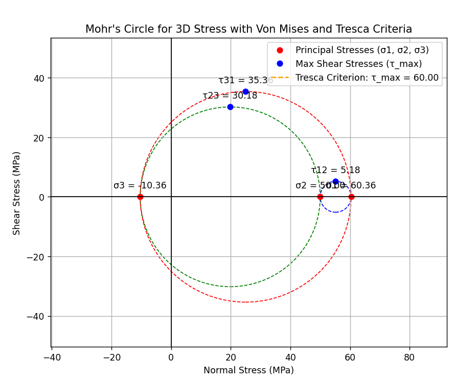

# Plasticity Criteria calculator

This Python script provides a graphical user interface (GUI) to perform basic 3D stress analysis using the Mohr's Circle and check the Tresca and Von Mises plasticity criteria. Users can input the components of the stress tensor, and the program will calculate and display the principal stresses, maximum shear stresses, and the results of the plasticity checks.

The Mohr's Circle for 3D stress is also plotted to visually represent the shear and normal stresses.

## Requirements

- Python 3.x
- `numpy`
- `matplotlib`
- `tkinter`

To install the required packages, run:

## Functionality

1. **Input Fields:**

   - **σxx, σxy, σxz, σyy, σyz, σzz:** Components of the 3D stress tensor.
   - **σc (Critical Stress):** The critical stress value used for Tresca and Von Mises criteria.

2. **Calculations:**

   - **Principal Stresses (Eigenvalues):** The program computes the principal stresses (σ1, σ2, σ3) of the stress tensor using eigenvalue decomposition.
   - **Tresca Criterion:** Checks if the maximum shear stress exceeds the critical stress.
   - **Von Mises Criterion:** Computes the Von Mises stress and checks if it exceeds the critical stress.

3. **Mohr's Circle Plot:**

   - Displays Mohr’s Circle for 3D stress, with the principal stresses plotted on the x-axis and the corresponding shear stresses plotted on the y-axis.
   - Visualizes the maximum shear stresses and the Tresca criterion.

4. **Plasticity Criteria:**
   - The program provides a result showing if the stress state is within acceptable limits based on the Tresca and Von Mises criteria.

## License

This code is licensed under the MIT License. You are free to modify and use the code for personal or educational purposes.
